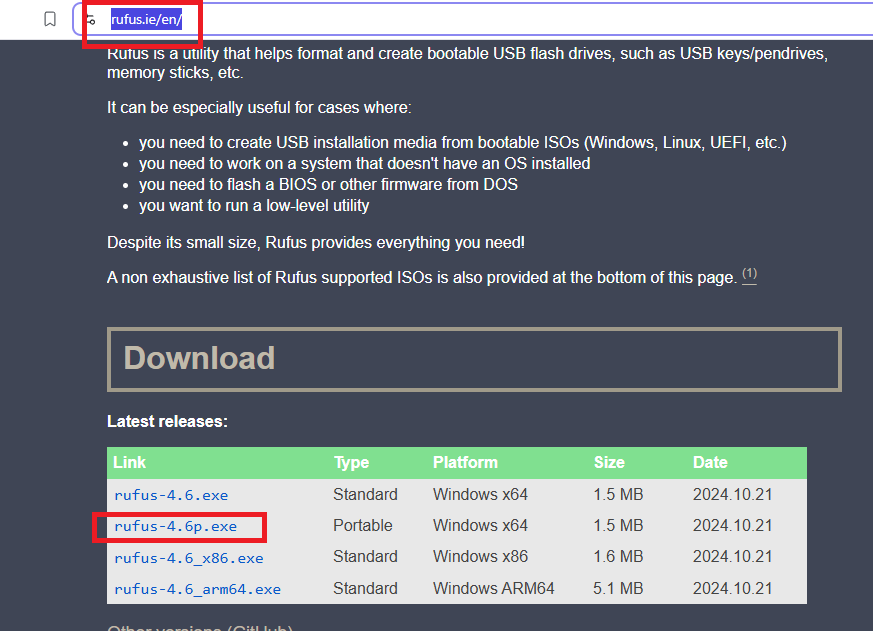

# SOP: Preparing Windows Server 2025 Installation (GUI)

**College:** Manitoba Institute of Trades and Technology (MITT)  
**Course:** Network and System Administration  
**Version:** 1.0  
**Written By:** Aaron Queskekapow  
**Approved By:** Felix  
**Date:** 03/26/2025  

---

## Approval

| Name   | Role     | Date Approved |
|--------|----------|----------------|
| Felix  | Approver | 03/26/2025     |

---

## Revision History

| Version | Date       | Description                   | Author              |
|---------|------------|-------------------------------|---------------------|
| 1.0     | 03/26/2025 | Initial release of the SOP     | Aaron Queskekapow   |

---

## Accountability Matrix

| Role     | Name              | Responsibility                  |
|----------|-------------------|----------------------------------|
| Author   | Aaron Queskekapow | Writing and structuring the SOP |
| Approver | Felix             | Review and approval             |

---

## Purpose  
This SOP is part of my assignment and demonstrates how to install the Desktop Experience version of Windows Server 2025 (GUI).

---

## Application  
This applies to anyone installing Windows Server 2025 with the Desktop Experience (GUI).

---

## Definitions  
- **ISO:** A file that contains an image of an operating system, used to install it on a computer or virtual machine.  
- **USB:** A flash drive that contains the OS ISO and is used to install the system.  
- **Desktop Experience:** A version of Windows Server that includes a full graphical user interface (GUI), similar to a standard Windows environment.  
- **Disk:** A physical storage device (such as an SSD or HDD) used to install and store the operating system and files.
- **Hostname:** The name assigned to a computer on a network, used to identify it within that network.

---

## Procedure Steps

### Step 1: Download the ISO

- Download the Windows Server 2025 ISO from the official Microsoft website.

### Step 2: Create a Bootable USB Drive

- Download and run **Rufus**.

- Select the Windows Server 2025 ISO file and your USB drive.  
- Use the default settings for a Windows installation.  
- Click **Start** and wait for the process to complete.

### Step 3: Boot from the USB  
- Turn on the computer and press the appropriate boot menu key:  
  - `F12` (Dell, Lenovo, Acer)  
  - `F9` (HP)  
  - `ESC` or `F8` (ASUS)  
- If you miss it, restart and try again.

- In the boot menu, select the **UEFI USB** (your USB drive).

- When prompted with “Press any key to boot from USB...”, press any key. 
- Windows Server Setup will begin.

### Step 4: Install Windows Server 2025  
- Choose your language and time settings, then click **Next**.  
- Select your keyboard layout, then click **Next**.  
- Click **Install Now**.  
- Check Install Windows Server and "I agree.." **Next**.

  
- Choose **Windows Server 2025 Standard Evaluation (Desktop Experience)** and click **Next**.
- Choose your disk (usually **Disk 0** or the largest available drive), then click **Next**.

- Click Install and Wait for installation to complete.

### Step 5: Final Setup

- Set the **Administrator** password when prompted and click **Finish**.

- Log in to confirm the installation was successful.

- Open **Server Manager**.  
- Click on **Local Server** in the left-hand menu.  
- Next to **Computer Name**, click the current name (e.g., `WIN-6OG0DUBK8TD`).

- Click the **Change** button.  
- Enter your new hostname and click **OK**.  
- Restart the server when prompted to apply the change.

---

### Completion
Windows Server 2025 is now prepared and ready for further configuration, such as domain setup, role installation, or network services.

---

## Resources  
- [Microsoft Windows Server 2025 ISO](https://www.microsoft.com/en-us/evalcenter/evaluate-windows-server-2025)  
- [Rufus](https://rufus.ie/en/)  

---

## Minimum System Requirements  
- **Processor:** 1.4 GHz 64-bit processor (compatible with x64 instruction set, supports NX and DEP, CMPXCHG16b, LAHF/SAHF, and PrefetchW)  
- **RAM:** 2 GB (for Server with Desktop Experience)  
- **Disk Space:** Minimum 32 GB  
- **Network:** Ethernet adapter capable of at least 1 Gbps throughput
